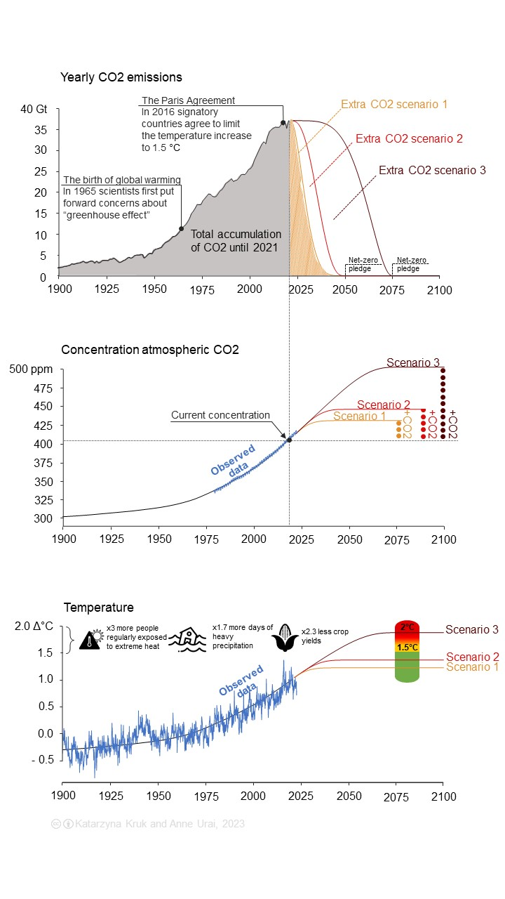

##  Net-zero scenarios

[![CC BY-SA 4.0][cc-by-sa-image]][cc-by-sa]

Scripts and graphics to show different net-zero scenarios and their consequences for atmospheric CO2 and global temperatures. See the graphics folder for powerpoint slides, images and a movie.

_Katarzyna Kruk and Anne Urai, Leiden University, 2023._

If you use the code or graphics, please cite: Kruk & Urai (2023). Net-zero scenarios. _Zenodo_, https://doi.org/10.5281/zenodo.7767084.

---

### Data sources
- carbon emissions: https://github.com/owid/co2-data
- carbon budgets: https://doi.org/10.18160/gcp-2022
- CO2 concentrations (Keeling curve): gml.noaa.gov/ccgg/trends/ 
- temperature record: https://data.giss.nasa.gov/gistemp/
- Thanks to Dr. Paul Behrens for advice on data sources and conversion factors.

### Further reading
- Friedlingstein et al. (2022). Global Carbon Budget 2021. Earth System Science Data, 14(4), 1917–2005. https://doi.org/10.5194/essd-14-1917-2022
- Rogelj, J., Forster, P. M., Kriegler, E., Smith, C. J., & Séférian, R. (2019). Estimating and tracking the remaining carbon budget for stringent climate targets. Nature, 571(7765). https://doi.org/10.1038/s41586-019-1368-z
- AR6 Synthesis Report Climate Change 2023 — IPCC. https://www.ipcc.ch/report/sixth-assessment-report-cycle/
- https://myclimatefuture.info/

[cc-by-sa]: http://creativecommons.org/licenses/by-sa/4.0/
[cc-by-sa-image]: https://licensebuttons.net/l/by-sa/4.0/88x31.png
[cc-by-sa-shield]: https://img.shields.io/badge/License-CC%20BY--SA%204.0-lightgrey.svg

